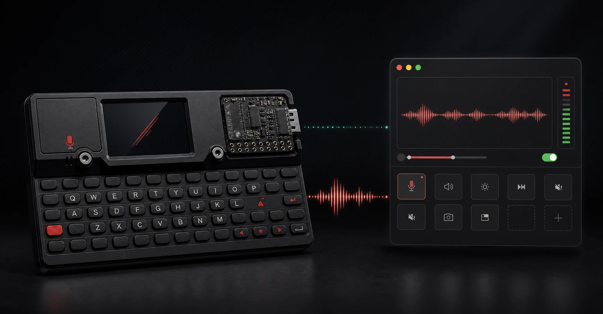
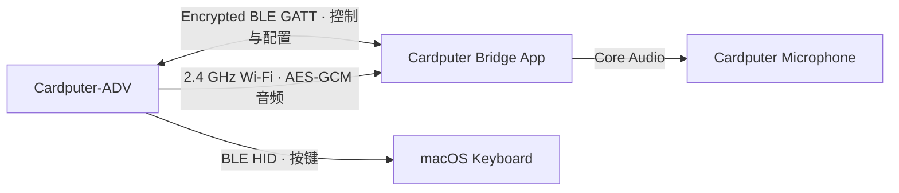

<div align="center">



# Cardputer Bridge

**把 Cardputer-ADV 变成 Mac 的无线麦克风与可编程快捷键盘。**

[](https://github.com/ivan-94/cardputer-bridge/actions/workflows/ci.yml)


</div>

Cardputer Bridge 让一台掌上 Cardputer 同时成为两种 macOS 系统输入：它通过 Bluetooth LE 发送按键和组合键，通过 2.4 GHz Wi-Fi 传输麦克风音频；原生 SwiftUI App 负责配对、网络、快捷键、麦克风和固件更新。

它适合放在键盘旁边，作为一块可以随手拿起的辅助输入设备：按一下实体键启动听写、静音会议、切换应用或执行复杂组合键；需要录音时，又能直接出现在 macOS 的系统麦克风列表中。

> [!IMPORTANT]
> Cardputer Bridge 不是“蓝牙麦克风”。Cardputer-ADV 不支持经典蓝牙音频；键盘与控制走 BLE，实时音频走局域网 Wi-Fi。

## 能做什么

| 能力 | 使用体验 | 实现通道 |
| --- | --- | --- |
| 系统麦克风 | 在录音、会议或语音应用中选择 `Cardputer Microphone` | Wi-Fi PCM → macOS App → Core Audio Plug-in |
| 辅助快捷键盘 | 普通按键直接输入，也可把任意实体组合映射为 Mac 快捷键 | BLE HID |
| 实体键学习 | 在 Cardputer 上按下要绑定的按键或组合，避免误录入 Mac 键盘 | 加密 BLE GATT |
| 麦克风控制 | G0 可切换录音意图；录音时实体 LED 常亮，静音时熄灭 | BLE 控制 + 设备状态机 |
| 配置中心 | 管理快捷键、2.4 GHz Wi-Fi、麦克风、开机启动和菜单栏状态 | 原生 SwiftUI App |
| 安全更新 | 首次 USB 安装；后续写入空闲 OTA 槽，启动失败自动回滚 | USB + 双分区 Wi-Fi OTA |

一些实际用法：

- 将 `G0` 映射为 macOS 听写或会议静音快捷键。
- 将 `G0 + Q` 映射为 `⌃⌘Q`，保留普通 `Q` 的直接输入。
- 为剪辑、直播、开发和会议软件制作一组随手可按的实体操作。
- 把 Cardputer 放到更合适的位置，作为轻量语音输入端使用。

## 工作方式



Cardputer 与 Mac 之间不是一条万能连接，而是三条职责明确的链路：

- **BLE HID** 交给系统处理按键，App 不需要伪造普通键盘输入。
- **加密 GATT** 处理配对、心跳、配置同步、麦克风意图和 OTA 指令。
- **Wi-Fi 音频** 传输 16 kHz 单声道 PCM；App 完成重排、重采样和系统麦克风桥接。

控制链失联时，设备会自动停止传音并释放按键，避免卡键或无人值守录音。

## macOS App

App 提供六步首次设置，以及概览、快捷键、麦克风、设备与连接、设置、关于六个日常入口。

- 安全发现并配对附近的 Cardputer。
- 扫描并配置 2.4 GHz Wi-Fi。
- 从 Cardputer 实体键盘学习任意按键或组合键。
- 输出特殊键、左右修饰键，以及只有修饰键的组合。
- 查看电量、Wi-Fi 信号、麦克风状态与最近一次快捷键。
- 支持菜单栏常驻和登录时自动启动。
- 生成不包含密码、会话密钥、原始音频和键入内容的诊断报告。

## 安装

### 当前发布状态

`v0.10.3` 是当前公开预览版本。对应 tag 的发布工作流会同时生成 Apple silicon macOS App、Core Audio 麦克风驱动、图形化 DMG 安装盘、安装说明和 Cardputer-ADV 签名固件；资产发布完成后可从 [最新 Release](https://github.com/ivan-94/cardputer-bridge/releases/latest) 下载。macOS 产物使用 **ad-hoc 签名**，尚未经过 Apple 公证，因此首次打开需要由用户明确允许。固件镜像使用 ESP-IDF Secure Boot v2 格式的 RSA-3072 签名，OTA 发布清单另有 Ed25519 签名；当前没有熔断硬件 Secure Boot eFuse。发布前会在 macOS 上使用 App 的真实信任路径重新校验生成的清单。App 内的 Core Audio 驱动以签名 ZIP 资源保存，避免 macOS 27 Beta 在启动前扫描嵌套 `.driver` 时卡死；用户选择安装系统麦克风后才会解压、验签并安装。

1. 从 Release 下载 `Cardputer-Bridge-v0.10.3-macOS-arm64.dmg` 和同名 `.dmg.sha256` 文件。
2. 在下载目录运行 `shasum -a 256 -c Cardputer-Bridge-v0.10.3-macOS-arm64.dmg.sha256`。
3. 打开 DMG，将 App 拖到 `Applications`；若 macOS 显示“Apple 无法验证”并提供“移动到废纸篓”，点击“完成”，然后到“系统设置 → 隐私与安全性”选择“仍要打开”。DMG 内的“安装说明”提供了逐步图文风格指引。
4. 在 App 首次设置中点击“安装系统麦克风”，完成一次管理员认证；然后通过 USB 连接 Cardputer-ADV，由 App 完成首次固件安装。
5. 按向导完成 BLE 安全配对和 2.4 GHz Wi-Fi 配置。此后 App 可检查 GitHub 签名更新，不必反复覆盖整片 Flash。

macOS App 目前仍需手工下载升级。由于每个 ad-hoc 版本都有新的代码摘要，macOS 可能再次要求“仍要打开”；这是身份与公证限制，不是应用数据被清空。v0.10.3 已移除 App 内裸露的嵌套 `.driver`，不会再触发 v0.10.2 在 macOS 27 Beta 上的无限 Dock 跳动。若这台 Mac 曾经运行过有问题的 v0.10.2，系统可能保留旧路径的错误策略记录；将新版暂时命名为 `Cardputer Bridge v0.10.3.app` 即可绕开该记录，App 内显示名称和配置不受影响。

如所在环境无法挂载 DMG，可下载 ZIP 与对应校验文件作为备用包。

> [!WARNING]
> ad-hoc 签名只能证明下载后的包在校验后没有被本机再次修改，不提供 Apple 开发者身份或公证背书。请只从本仓库 Release 下载，并先验证 SHA-256。

### 从源码运行 macOS App

要求：Apple Silicon Mac、macOS 15 或更新版本、Xcode、[XcodeGen](https://github.com/yonaskolb/XcodeGen)。当前已验证构建环境使用 Xcode 27 Beta。

```bash
brew install xcodegen
./scripts/env-check.sh
./scripts/build-macos.sh
./scripts/restart-macos-app.sh
```

构建并安装系统麦克风 Plug-in 会修改 `/Library/Audio/Plug-Ins/HAL`，脚本会明确请求管理员权限并保留可恢复备份：

```bash
./scripts/build-audio-plugin.sh
./scripts/install-audio-plugin.sh --confirm-system-change --reload-coreaudio
```

如果只想研究键盘、协议或 UI，不必安装音频 Plug-in。

## 固件与 OTA

Cardputer-ADV 当前使用 ESP-IDF `5.4.2`，Flash 布局包含 `factory`、`ota_0` 和 `ota_1`。从旧版单分区固件迁移时，App 通过 USB 写入新的 bootloader、分区表、OTA data 和应用镜像，但不会整片擦除，也不会覆盖保存 Wi-Fi、BLE bond 与快捷键配置的 NVS。

后续 OTA 复用同一套镜像校验、空闲槽写入、健康确认与回滚机制，支持两个固件来源：

- **GitHub Release**：面向普通用户的签名稳定版。
- **本地 `.bin`**：面向开发者的快速部署入口。

当前代码已经实现 GitHub URL OTA；Mac 选择本地固件并通过局域网推送的入口仍在开发中。新镜像必须通过产品身份、版本、完整下载和 RSA-3072 签名检查，启动后稳定运行 10 秒才会被标记为健康。

## 开发与验证

```bash
# 快速、无需硬件
make verify-contracts
make verify-host
make verify-macos

# 需要 ESP-IDF 5.4.2
make build-firmware
make verify-firmware

# 聚合验证；包含 USB 真机检查
make verify
```

仓库把硬件逻辑与可在主机运行的领域内核分开，故意错误的 fixture 必须被 verifier 拒绝，真实硬件测试也不会被模拟输入冒充。

```text
firmware/       ESP-IDF 固件、输入路由、配置事务与设备状态机
macos/          SwiftUI App、BLE 控制、Wi-Fi 音频与更新入口
audio-plugin/   macOS Audio Server Plug-in 与共享音频环形缓冲区
harness/        独立 verifier、合同、fixture 与证据 runner
scripts/        构建、安装、发布、HIL 和恢复脚本
docs/           协议、Gate 与实机验证记录
```

## 已验证状态

- Cardputer-ADV 已完成 `0.10.0` 双 OTA 分区的 USB 迁移，四个写入区域逐字节校验通过。
- 迁移保留了 Wi-Fi、BLE bond 和快捷键配置。
- BLE 键盘、加密控制、真实 Wi-Fi 音频、系统麦克风、默认静音与录音 LED 已通过当前设备实测。
- macOS 测试、host 测试、contract verifier、ESP-IDF 构建与 GitHub CI 已通过。

仍未完成的生产验证包括真实 Release OTA、更新过程断电回滚、本地 `.bin` 推送、长时间运行、复杂丢包/时钟漂移，以及多个会议和录音应用的最终听感。

完整实机边界见 [FF-7 USB 迁移证据](docs/evidence/FF-7-USB-migration-0.10.0-2026-08-29.md)。

## 安全边界

- 配置与控制使用要求加密和 MITM 防护的 BLE GATT。
- Wi-Fi 音频使用 AES-256-GCM，并为每次 App 会话轮换密钥与 nonce 空间。
- 心跳或控制链丢失后默认静音并释放全部按键。
- 发布清单、下载产物和固件镜像分别进行签名或摘要校验。
- 当前尚未熔断 ESP32-S3 Secure Boot eFuse；拥有设备物理访问权的人仍可进入 ROM download mode 重刷。

## 参与项目

欢迎通过 [Issues](https://github.com/ivan-94/cardputer-bridge/issues) 报告问题或讨论功能。提交硬件相关问题时，请附上 Cardputer 型号、macOS 版本、固件版本、复现步骤和脱敏后的诊断信息。

仓库目前还没有确定开源许可证。在添加 `LICENSE` 之前，源码虽然公开可读，但不应被视为已经授予复制、修改或再分发许可。

## 致谢

- [M5Stack Cardputer-ADV](https://docs.m5stack.com/en/core/Cardputer-Adv)
- [M5Unified](https://github.com/m5stack/M5Unified)
- [ESP-IDF](https://github.com/espressif/esp-idf)
