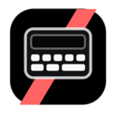
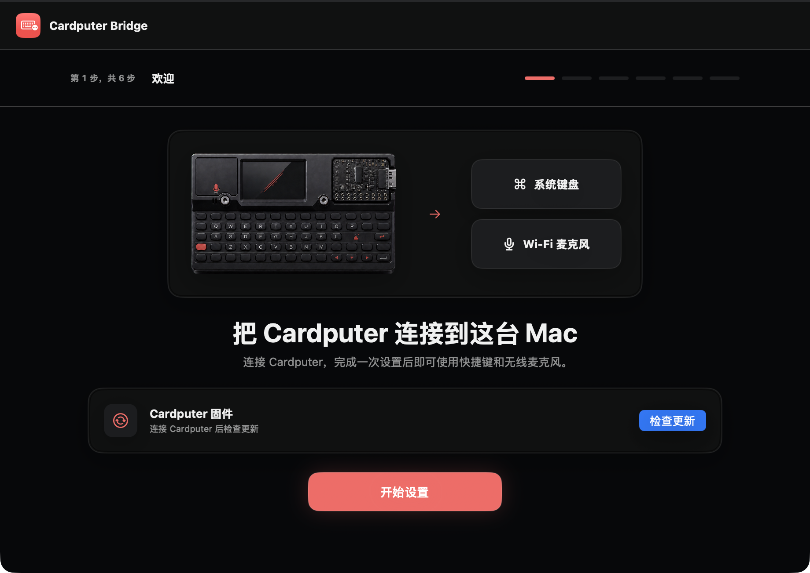
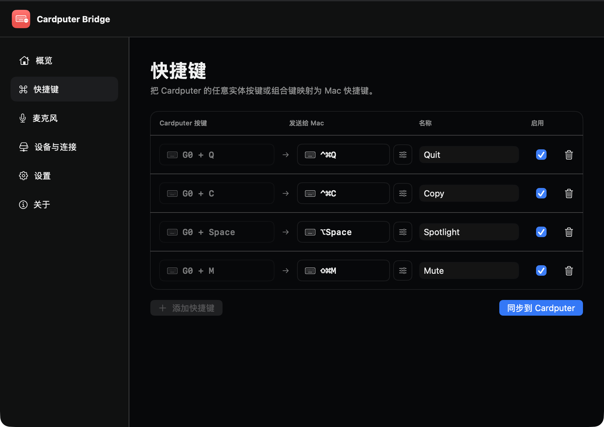
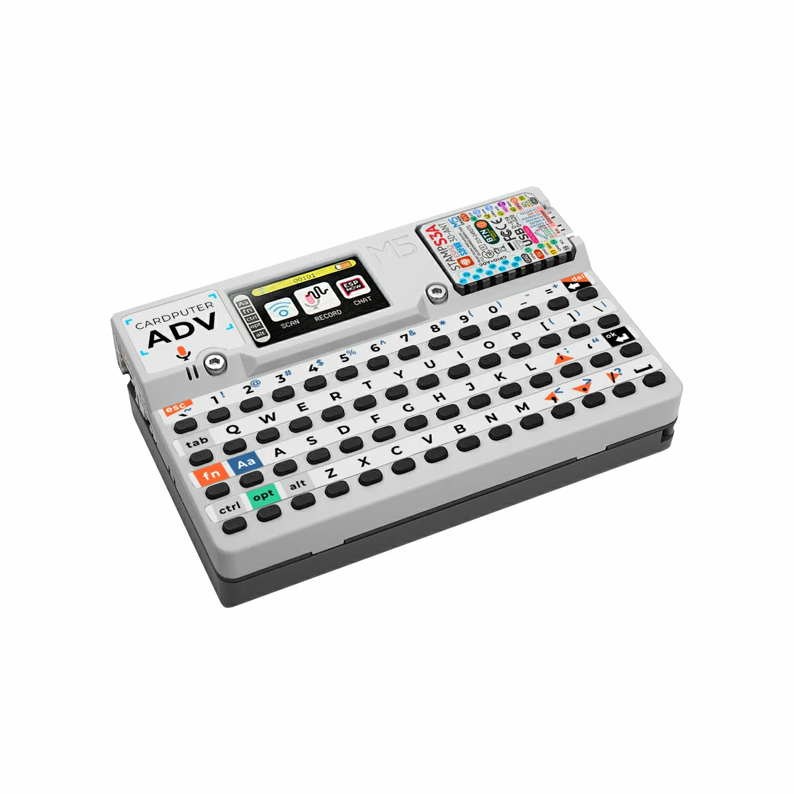

<div align="center">



# Cardputer Bridge

**把 Cardputer-ADV 变成 Mac 的无线麦克风和可编程快捷键盘。**

[下载最新版](https://github.com/ivan-94/cardputer-bridge/releases/latest) · [报告问题](https://github.com/ivan-94/cardputer-bridge/issues)

[](https://github.com/ivan-94/cardputer-bridge/actions/workflows/ci.yml)


</div>



Cardputer Bridge 让 Cardputer-ADV 同时成为两种 macOS 输入设备：实体键盘通过 Bluetooth LE 发送按键，无线麦克风通过局域网传输声音。Mac App 负责首次连接、快捷键配置、麦克风控制和固件更新。

它不是主力键盘的替代品，更像一块放在手边的控制面板：一个按键可以开始听写、静音会议、切换应用，或者发送任何你常用的 Mac 快捷键。

## 你需要准备

| 必需品 | 要求 |
| --- | --- |
| Cardputer | **M5Stack Cardputer-ADV**。当前固件不支持初代 Cardputer |
| Mac | Apple Silicon，macOS 15 或更新版本 |
| 网络 | Cardputer 可连接的 2.4 GHz Wi-Fi；Mac 与它位于同一局域网 |
| USB 线 | 可传输数据的 USB-C 线，用于首次安装固件和故障恢复 |
| 管理员权限 | 安装 `Cardputer Microphone` 系统输入设备时需要认证一次 |

> Cardputer-ADV 不支持经典蓝牙音频。键盘和控制使用 Bluetooth LE，麦克风声音使用 Wi-Fi。

## 安装

1. 从 [Releases](https://github.com/ivan-94/cardputer-bridge/releases/latest) 下载最新的 `macOS-arm64.dmg`。
2. 打开 DMG，把 **Cardputer Bridge** 拖入“应用程序”。
3. 首次打开 App，按引导安装 `Cardputer Microphone`，再用 USB 连接 Cardputer-ADV 安装固件。
4. 完成蓝牙配对并为 Cardputer 选择 2.4 GHz Wi-Fi。

### 如果 macOS 阻止打开

当前发布版使用 ad-hoc 签名，没有经过 Apple 公证。若系统提示“Apple 无法验证”：

1. 点击“完成”，不要把 App 移到废纸篓。
2. 打开“系统设置 → 隐私与安全性”。
3. 找到 Cardputer Bridge，点击“仍要打开”。每次替换为新的 ad-hoc 版本后，macOS 都可能再次要求确认。

请只从本仓库的 Release 下载。每个 DMG 都附带 `.sha256` 文件，可在下载目录验证：

```bash
shasum -a 256 -c Cardputer-Bridge-*-macOS-arm64.dmg.sha256
```

## 快捷键



快捷键的触发键只能从 Cardputer 实机录入，避免误把 Mac 键盘事件保存进去。一个映射由三部分组成：

- **Cardputer 按键**：任意实体按键或组合键，例如 `G0`、`G0 + Q`、`Fn + 1`。
- **发送给 Mac**：普通键、特殊键、左右修饰键，或者只有修饰键的组合。
- **名称**：给这项操作一个容易识别的名字。

修改后点击“同步到 Cardputer”。命中映射时，Cardputer 会发送设定的 Mac 快捷键；未映射的普通按键仍按键盘方式输入。

## 无线麦克风

在 macOS 的录音、会议或语音 App 中选择 **Cardputer Microphone**。声音由 Cardputer 通过 Wi-Fi 发送给 Mac，蓝牙继续负责静音和连接控制。

- 麦克风默认静音。
- 开始录音时，Cardputer 的 LED 会以低亮度红色常亮。
- 控制连接中断时，Cardputer 会停止发送声音。
- App 可以常驻菜单栏，也可以登录 Mac 后自动启动。

## Cardputer-ADV

<p align="center">
  
</p>

Cardputer-ADV 把 ESP32-S3、屏幕、键盘、麦克风、电池和扩展接口装进一台掌上设备。本项目使用它自带的键盘与麦克风，不需要焊接额外模块。

产品资料：[M5Stack Cardputer-ADV](https://docs.m5stack.com/en/core/Cardputer-Adv)

## 更新

- **Cardputer 固件**：首次使用 USB 安装；之后可由 Mac App 检查并通过 Wi-Fi 更新。
- **macOS App**：从 Releases 下载新版 DMG，拖入“应用程序”并替换旧版本。ad-hoc 版本更新后，macOS 可能再次要求“仍要打开”。

固件更新采用双分区和启动确认。更新失败时，设备会回到上一份可启动固件。

## 从源码构建

需要 Xcode、[XcodeGen](https://github.com/yonaskolb/XcodeGen) 和 ESP-IDF 5.4.2。

```bash
brew install xcodegen
./scripts/env-check.sh
./scripts/build-macos.sh
./scripts/restart-macos-app.sh
```

常用验证命令：

```bash
make verify-contracts
make verify-host
make verify-macos
make build-firmware
```

项目目录：

```text
firmware/       Cardputer-ADV 固件
macos/          SwiftUI App
audio-plugin/   macOS 系统麦克风组件
harness/        可在主机运行的验证脚手架
scripts/        构建、安装与发布脚本
docs/           协议与实机验证记录
```

## 当前限制

- 只支持 Cardputer-ADV 与 Apple Silicon Mac。
- Mac App 尚未经过 Apple 公证，也没有自动更新。
- Cardputer 必须能够接入 2.4 GHz Wi-Fi。

## 参与项目

欢迎通过 [Issues](https://github.com/ivan-94/cardputer-bridge/issues) 报告问题。请附上 Cardputer 型号、macOS 版本、固件版本和复现步骤；不要上传 Wi-Fi 密码或未脱敏的诊断信息。

仓库目前没有 `LICENSE`。在许可证加入之前，源码公开可读，但尚未授予复制、修改或再分发许可。

## 致谢

- [M5Stack](https://m5stack.com/)
- [M5Unified](https://github.com/m5stack/M5Unified)
- [ESP-IDF](https://github.com/espressif/esp-idf)
